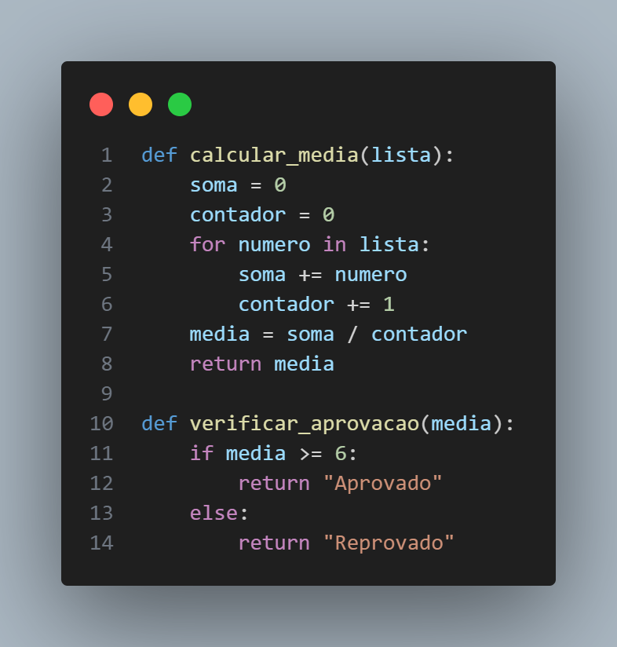
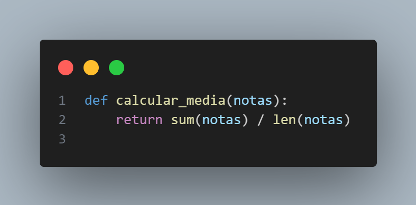
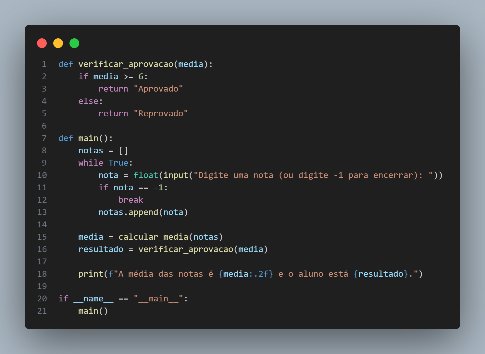
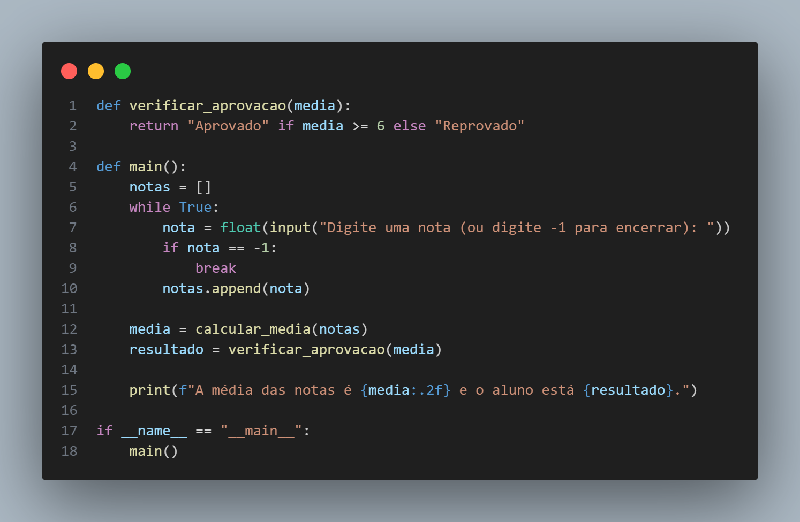

# Descrição
Foi Realizada a refatoração de um codigo que eu tinha de outra disciplina, um código simples onde pega algumas notas e faz uma média e diz se o aluno está aprovado ou nao.

## Implementa

- Melhor nomenclatura das Variaveis 
- Melhor nomenclatura das Funções
- Melhor separação das funções 

## Ajustes

### Função

 

 

Criação de uma função para calcular a média das notas. 

### Variaveis

 

 

## Tipo de mudança (marcar as alternativas que se encaixam)
- [x] Nova Funcionalidade
- [ ] Correções de bugs
- [x] Ajuste

# Como foi testado?
não foram realizados teste pois aa funções da Imobiliaria / construtora  não possuem retorno explicito, alem dos Getter, mas como eles retornam atributos não houve a necessidade disto

# Checklist:
- [x] Meu código segue os padrões do repositório, como gitmoji e commits organizados e com mensagens adequadas
- [x] Meu código segue os padrões deste projeto
- [ ] Escrevi testes automatizados necessários para esta entrega
- [x] Testei exaustivamente a entrega
- [x] Revisei o código que está sendo entregue
- [x] Documentei de alguma forma o que foi feito para auxiliar próximos devs (em código, insomnia, documentos auxiliares)
- [x] Minhas mudanças não geram nenhum motivo de alerta ou possível quebra de outras funcionalidades

# Informações adicionais:
como foi dito no inicio, o projeto foi originalmente pensado com o uso do Clean Code, então não houve muitas mudanças
